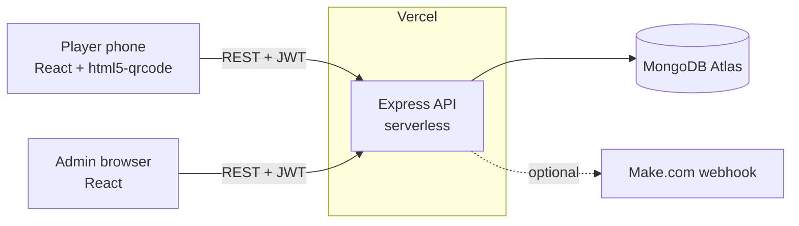
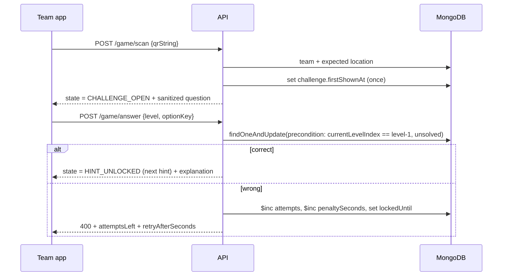

# TraceRoute: Architecture



## Stack

| Layer | Tech |
| :-- | :-- |
| Frontend | React 18, Vite 5, Tailwind 3 (neo-brutalist), react-router 6, axios, html5-qrcode, recharts, qrcode |
| Backend | Node 18+, Express 4, Mongoose 8, jsonwebtoken, helmet, express-rate-limit |
| Data | MongoDB Atlas. Collections: `teams` (players **and** admins by `role`), `locations`, `questions`, `settings` |
| Hosting | Vercel (frontend static, backend serverless). `maxPoolSize: 1` per instance |

There are no sockets. The team app refreshes state after each action, on tab focus and every 15 s; the admin dashboard polls every 10 s.

## Data model

**Team**: `teamId, name, email (team lead), passwordHash, salt, role, path[], currentLevelIndex, lastLevelCompletedAt, levelHistory[], collectedKeywords[], finaleChallenge, penaltySeconds, finaleAttempts, finaleLockedUntil, activeSessions[]` and

```
challenges: [{ level, questionId, optionOrder[], attempts, solved,
               firstShownAt, solvedAt, lockedUntil }]
```

**Location**: `locationId (0 = Start), name, hint, qrSecret, keyword (hop code)`.

**Question**: `questionId, prompt, options[{key,text}], correctKey, explanation, section, difficulty, active`.

**Settings** (one document, `key: "main"`): `eventName, tagline, totalLevels, maxAttemptsPerQuestion, wrongAnswerCooldownSeconds, wrongAnswerTimePenaltySeconds, outOfAttemptsAction, eventStatus, showLeaderboardToTeams`.

## Request flow (a hop)



The client never decides anything: the server returns a full `state` object on every call and the UI renders it.

## Key modules

| File | Responsibility |
| :-- | :-- |
| `controllers/gameController.js` | `buildState`, `scanQR`, `answerChallenge`, `submitAnswer` (Mega Puzzle) |
| `controllers/adminController.js` | Leaderboard aggregation, teams, locations, settings, question bank, results CSV |
| `services/teamService.js` | Balanced path generation, team creation, webhook |
| `services/questionService.js` | Assign questions to a team, pick replacements |
| `utils/questionLogic.js` | Markdown parser, difficulty ramp, least-used picker, answer-free serializer |
| `utils/finale.js` | Mega Puzzle ordering rules |
| `middleware/authMiddleware.js` | JWT + live-session check, role gate |

## Scalability notes

- The hot path is a few indexed single-document reads/writes per request. A 1,000-player event fits comfortably on the free Atlas tier plus Vercel.
- Campus Wi-Fi often NATs many phones behind one IP, so rate limits are keyed on the auth token, not the IP (login excepted).
- Question and location lookups are small; add caching only if profiling shows a need.
