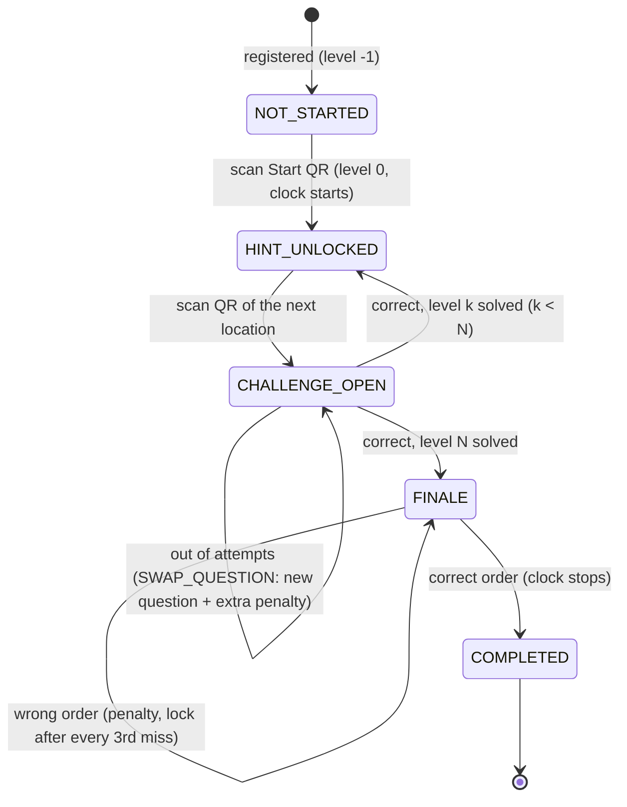
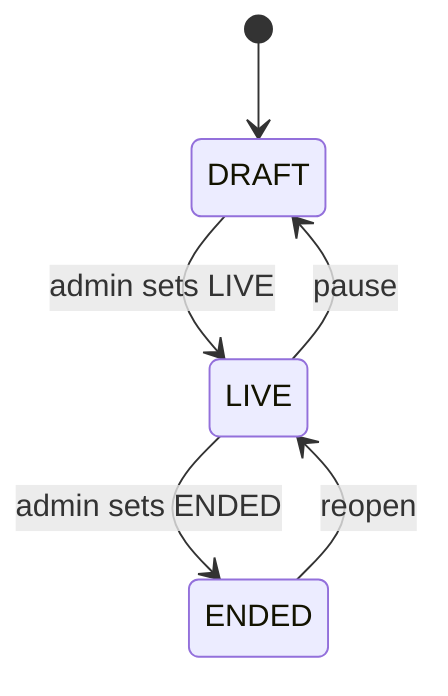

# TraceRoute: State Machine

## Team state



`LOCK_UNTIL_ADMIN` replaces the "new question" transition with a locked `CHALLENGE_OPEN` until an organiser unlocks it.

## Event gate



Players can scan and answer only while `LIVE`. `GET /game/state` always works.

## Level index

```
-1  not started          0  Start scanned        k  hop k solved
 N  Mega Puzzle open (N = path.length - 1)       N+2 finished (path.length + 1)
```
