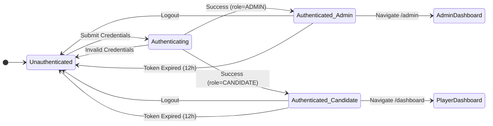
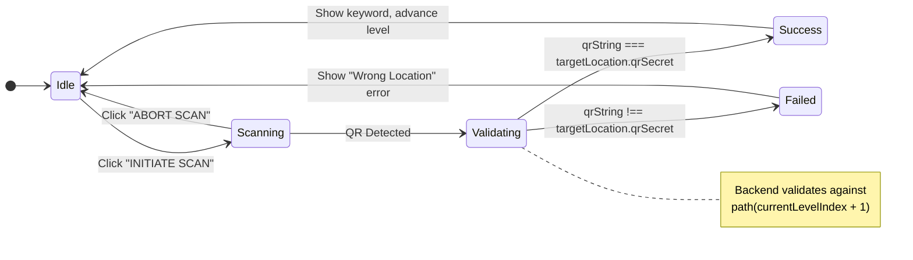
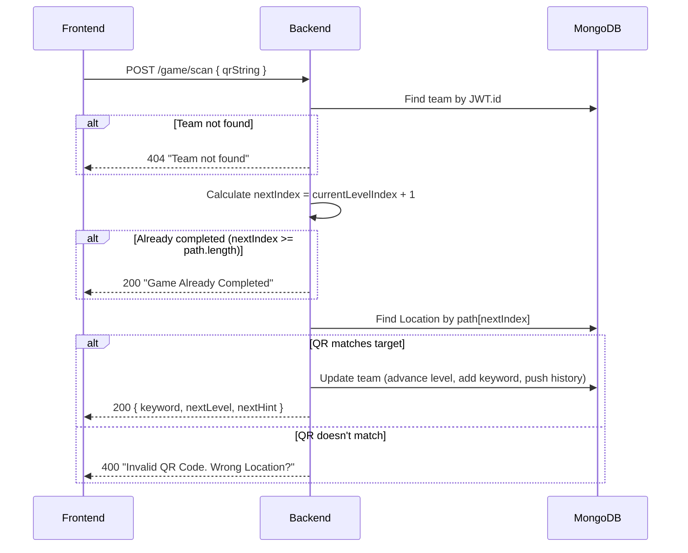
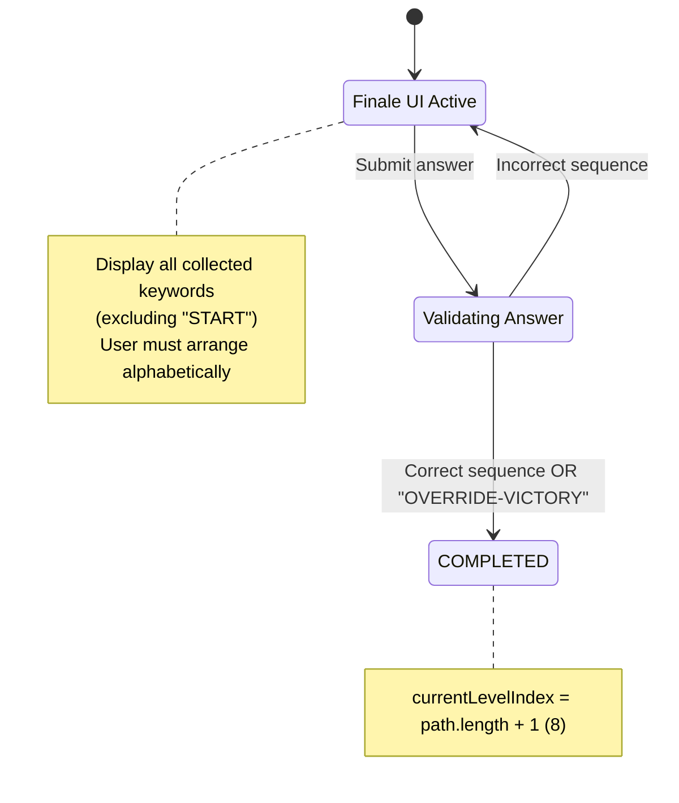
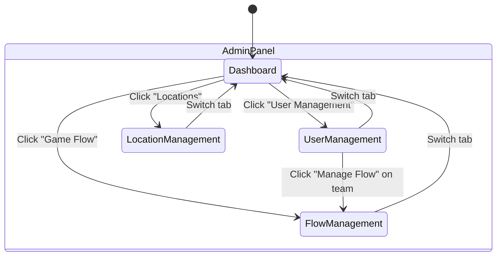
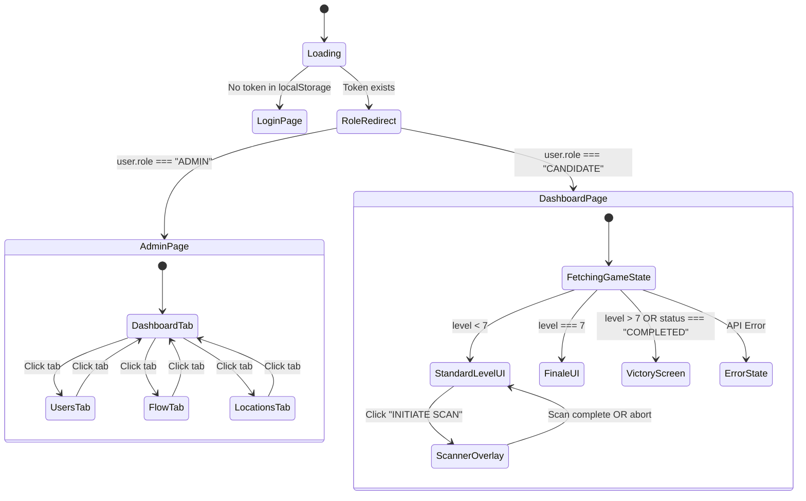
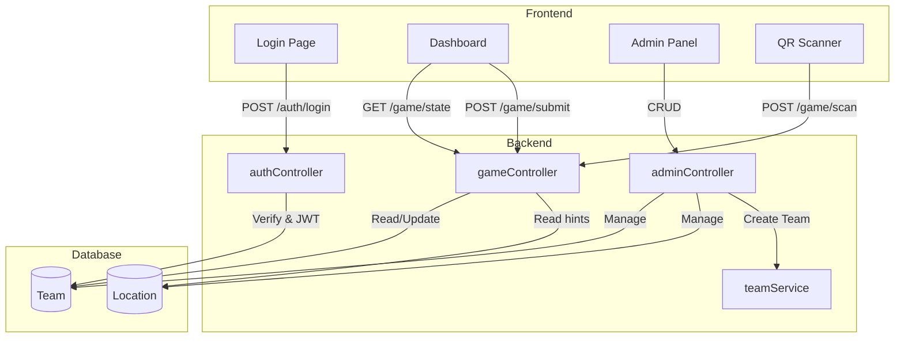

# TreasureHunt State Machine Diagram

> System-level view of all state transitions across Frontend and Backend

---

## 1. System Overview

The TreasureHunt application is a multiplayer QR-code-based treasure hunt game with:

- **2 User Roles**: `CANDIDATE` (players) and `ADMIN` (game masters)
- **7 Game Levels**: Path of 7 locations (Start + 6 random locations)
- **Finale**: BitLocker decryption puzzle using collected keywords

---

## 2. Authentication State Machine



### Auth Flow Details

| Transition                       | Trigger                 | Backend Action                  | Frontend Action             |
| -------------------------------- | ----------------------- | ------------------------------- | --------------------------- |
| Unauthenticated → Authenticating | Form Submit             | `POST /auth/login`              | Show Loader                 |
| Authenticating → Authenticated   | Valid teamId + password | Generate JWT (12h), add session | Store token in localStorage |
| Authenticating → Unauthenticated | Invalid credentials     | Return 401                      | Show error message          |
| Authenticated → Unauthenticated  | Logout button           | -                               | Clear localStorage, reload  |

### Session Management

- Max 4 concurrent sessions per team (FIFO eviction)
- Sessions tracked via `activeSessions[]` containing JWT IDs (`jti`)

---

## 3. Game Progression State Machine (Core)

This is the primary state machine tracking a team's progress through the treasure hunt.

```mermaid
stateDiagram-v2
    direction TB

    [*] --> Registered

    state "currentLevelIndex = -1" as Registered
    state "currentLevelIndex = 0" as Level0
    state "currentLevelIndex = 1" as Level1
    state "currentLevelIndex = 2" as Level2
    state "currentLevelIndex = 3" as Level3
    state "currentLevelIndex = 4" as Level4
    state "currentLevelIndex = 5" as Level5
    state "currentLevelIndex = 6 (FINALE)" as Finale
    state "currentLevelIndex ≥ 7 (COMPLETED)" as Completed

    Registered --> Level0 : Scan Start QR (Location 0)
    Level0 --> Level1 : Scan QR at path[1]
    Level1 --> Level2 : Scan QR at path[2]
    Level2 --> Level3 : Scan QR at path[3]
    Level3 --> Level4 : Scan QR at path[4]
    Level4 --> Level5 : Scan QR at path[5]
    Level5 --> Finale : Scan QR at path[6]
    Finale --> Completed : Submit correct answer

    note right of Registered : Team created via Admin<br/>Path assigned: (0, x, x, x, x, x, x)
    note right of Finale : BitLocker puzzle<br/>Arrange keywords alphabetically
    note right of Completed : Game Over<br/>Victory screen shown
```

### Level Progression Details

| Level Index | Status        | What Team Sees              | Required Action                       |
| ----------- | ------------- | --------------------------- | ------------------------------------- |
| `-1`        | REGISTERED    | Hint for Location 0 (Start) | Scan Start QR                         |
| `0`         | HINT_UNLOCKED | Hint for `path[1]`          | Scan QR at `path[1]`                  |
| `1`         | HINT_UNLOCKED | Hint for `path[2]`          | Scan QR at `path[2]`                  |
| `2`         | HINT_UNLOCKED | Hint for `path[3]`          | Scan QR at `path[3]`                  |
| `3`         | HINT_UNLOCKED | Hint for `path[4]`          | Scan QR at `path[4]`                  |
| `4`         | HINT_UNLOCKED | Hint for `path[5]`          | Scan QR at `path[5]`                  |
| `5`         | HINT_UNLOCKED | Hint for `path[6]`          | Scan QR at `path[6]`                  |
| `6`         | FINALE        | BitLocker UI + Keywords     | Submit alphabetically sorted keywords |
| `≥7`        | COMPLETED     | Victory Screen              | None (Game Over)                      |

---

## 4. QR Scan Flow State Machine



### QR Scan API Flow



---

## 5. Finale (BitLocker) State Machine



### Answer Validation Logic

```javascript
// Expected answer computation (Backend)
const expected = team.collectedKeywords
  .map((k) => k.trim().toUpperCase())
  .filter((k) => k !== "START") // Exclude START keyword
  .sort() // Alphabetical order
  .join("-"); // Hyphen-separated

// Example: If keywords are ["RIO", "ALICIA", "BERLIN", "START"]
// Expected = "ALICIA-BERLIN-RIO"
```

---

## 6. Admin Operations State Machine



### Admin Actions and Their Effects

| Action           | API Endpoint                | State Change                                         |
| ---------------- | --------------------------- | ---------------------------------------------------- |
| Create Team      | `POST /admin/teams`         | New team with `currentLevelIndex: -1`, random `path` |
| Delete Team      | `DELETE /admin/teams/:id`   | Team removed from DB                                 |
| Update Team Path | `PUT /admin/teams/:id/path` | Team's `path[]` modified                             |
| Update Location  | `PUT /admin/locations/:id`  | Location's `hint` or `qrSecret` changed              |
| View Stats       | `GET /admin/stats?level=X`  | No state change (read-only)                          |

---

## 7. Frontend UI State Machine



---

## 8. Data Flow Summary



---

## 9. Edge Cases & Potential Issues

### ⚠️ Identified Edge Cases

| Edge Case                             | Current Behavior                                                     | Potential Issue                             |
| ------------------------------------- | -------------------------------------------------------------------- | ------------------------------------------- |
| Scan same QR twice                    | Returns "Game Already Completed" if at end, otherwise allows re-scan | ✅ Handled - duplicate keyword check exists |
| Submit finale before reaching level 6 | Returns 400 "Not authorized for finale decryption"                   | ✅ Handled                                  |
| Multiple users on same team           | FIFO session management (max 4)                                      | ✅ Handled                                  |
| Invalid JWT                           | 401 from middleware                                                  | ✅ Handled                                  |
| Missing location data                 | Returns 500 "Target Location Data Missing"                           | ⚠️ Should log more details                  |
| Empty keywords array at finale        | Will produce empty expected answer                                   | ⚠️ May need validation                      |

### 🔍 State Transition Gaps to Review

1. **No backward progression**: Once a level is completed, there's no mechanism to undo (intentional)
2. **No timeout/penalty**: Game has no time limits or penalties for wrong scans
3. **OVERRIDE-VICTORY**: Backdoor exists in finale validation - security concern?
4. **Session invalidation**: Old sessions aren't explicitly invalidated on logout

---

## 10. Quick Reference: All States

| Component         | State Variable      | Possible Values                           |
| ----------------- | ------------------- | ----------------------------------------- |
| **Auth**          | `user`              | `null`, `{ teamId, name, role, level }`   |
| **Game Progress** | `currentLevelIndex` | `-1` to `8+`                              |
| **Game Status**   | `status`            | `HINT_UNLOCKED`, `FINALE`, `COMPLETED`    |
| **User Role**     | `role`              | `CANDIDATE`, `ADMIN`                      |
| **Dashboard UI**  | `scanMode`          | `true`, `false`                           |
| **Admin UI**      | `activeTab`         | `dashboard`, `users`, `flow`, `locations` |
